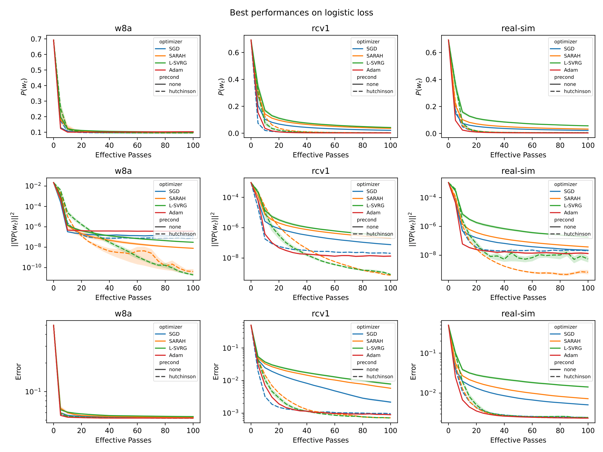

# PrecondUpdate

This is the official repository for the paper ["Stochastic Gradient Methods with Preconditioned Updates"][paper].

The idea focuses on preconditioned updates for SGD algorithms, specifically with variance-reduced optimizers, such as SVRG and PAGE. The preconditioner used is the hessian diagonal estimated with Hutchinson's trace method. This preconditioner works very well in practice, improving on the non-preconditioned optimizers by a large margin when the problem is ill-conditioned, while only introducing one additional gradient computation per update.

# How to run
First, download the datasets using `sh download_datasets.sh`. Then, you should install basic data science dependencies.
You most likely have them as they come with Anaconda.
If you have miniconda, run `conda install numpy scipy scikit-learn matplotlib seaborn pandas` (it might be missing a `-c conda-forge`).
You can run the main experiments without pytorch.
If you want pytorch, you can visit their website to find the installation command that suits your needs.

Once you have everything set, you can simply run the training with `python src/train.py`.
For running a whole array of experiments (or reproduce our experimental results), you can run `python src/run_experiment.py`.
To train in pytorch (i.e. use autograd), run `python src/pytorch/train.py`, or `python src/pytorch/run_experiment.py` for the experiments.

# Reproducibility
Our results are completely reproducible. We generate the data logs using the `run_experiment.py` scripts and hardcode the hyperparameter arrays in the script (works for now). Then, we make the plots using the plot notebooks in the root directory, namely `plot1.ipynb`, `plot2.ipynb`, and `plot_torch.ipynb`. Each of these notebooks generate different plots, some of which were used in the paper. Sometimes, the notebooks have to be run multiple times to account for all the combinations of hyperparameters and experiment settings.

If the user wants to use readily available data logs or wants to analyze the data logs used in our plots, then they can download the data logs from the links below.
| Log file   | Plotting script   | Link |
| - | - | - |
| logs1      | plot1.ipynb       | [logs1.zip][link1] |
| logs2      | plot2.ipynb       | [logs2.zip][link2] |
| logs_torch | plot_torch.ipynb  | [logs_torch.zip][link_torch] |

[paper]: https://arxiv.org/abs/2206.00285
[link1]: https://mbzuaiac-my.sharepoint.com/:u:/g/personal/abdulla_almansoori_mbzuai_ac_ae/EexJ9vFoalxOj2beIKbuRjcBQH9oEPDfBFmCDKTSgJZEQQ?e=0mRzQF
[link2]: https://mbzuaiac-my.sharepoint.com/:u:/g/personal/abdulla_almansoori_mbzuai_ac_ae/EfoULDS7xbhPp03-6O_WiBIBsLJ1E7CbNmGqkdJEGnIEcg?e=CYOnjT
[link_torch]: https://mbzuaiac-my.sharepoint.com/:u:/g/personal/abdulla_almansoori_mbzuai_ac_ae/EeLt0JuliFtLscjnzOycaeIBtTo-SvVVRxQyNNRlcFjdaA?e=iKMbNR
